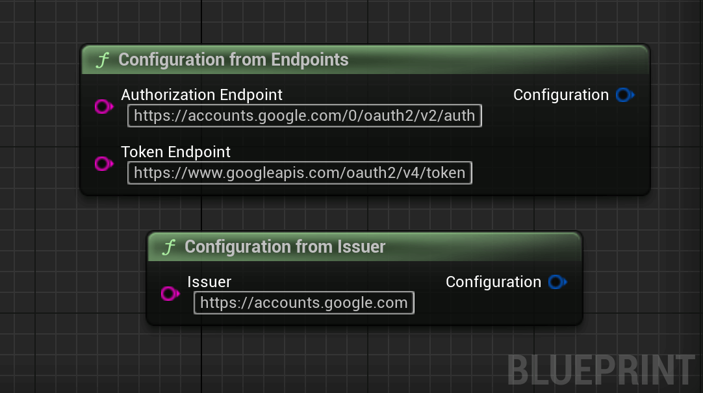

# Using the Plugin

## Specifying the Configuration

The first step is to create a configuration for the provider. For that, there are two possibilities.


<div class="code-switcher show-cpp-false">
<div class="switcher" >
<span class="sw-bp" onclick="switchBp()">Blueprints</span><span class="sw-cpp" onclick="switchCpp()">C++</span>
</div>
<div class="cpp">

```cpp
// As an issuer.
FOIDConfiguration Configuration = FOIDConfiguration::FromIssuer(TEXT("https://accounts.google.com"));

// Or directly with the endpoints.
FOIDConfiguration Configuration = FOIDConfiguration::FromEndpoints
(
    TEXT("https://accounts.google.com/0/oauth2/v2/auth"),
    TEXT("https://www.googleapis.com/oauth2/v4/token")  
);

```

</div>
<div class="bp">
<div class="bpcode">
<textarea readonly>
Begin Object Class=/Script/BlueprintGraph.K2Node_CallFunction Name="K2Node_CallFunction_1"
   bIsPureFunc=True
   FunctionReference=(MemberParent=Class'"/Script/OAuth2.OAuth2BlueprintLibrary"',MemberName="ConfigurationFromIssuer")
   NodePosX=-43
   NodePosY=-704
   NodeGuid=06E103F1429560499D1135AD88678332
   CustomProperties Pin (PinId=AD81A15742E9ADC3D7C6B8834FE27C63,PinName="self",PinFriendlyName=NSLOCTEXT("K2Node", "Target", "Target"),PinToolTip="Target\nOAuth 2Blueprint Library Object Reference",PinType.PinCategory="object",PinType.PinSubCategory="",PinType.PinSubCategoryObject=Class'"/Script/OAuth2.OAuth2BlueprintLibrary"',PinType.PinSubCategoryMemberReference=(),PinType.PinValueType=(),PinType.ContainerType=None,PinType.bIsReference=False,PinType.bIsConst=False,PinType.bIsWeakPointer=False,PinType.bIsUObjectWrapper=False,PinType.bSerializeAsSinglePrecisionFloat=False,DefaultObject="/Script/OAuth2.Default__OAuth2BlueprintLibrary",PersistentGuid=00000000000000000000000000000000,bHidden=True,bNotConnectable=False,bDefaultValueIsReadOnly=False,bDefaultValueIsIgnored=False,bAdvancedView=False,bOrphanedPin=False,)
   CustomProperties Pin (PinId=9BBD52C14A2E074AD9A81898542CD804,PinName="Issuer",PinToolTip="Issuer\nString",PinType.PinCategory="string",PinType.PinSubCategory="",PinType.PinSubCategoryObject=None,PinType.PinSubCategoryMemberReference=(),PinType.PinValueType=(),PinType.ContainerType=None,PinType.bIsReference=False,PinType.bIsConst=False,PinType.bIsWeakPointer=False,PinType.bIsUObjectWrapper=False,PinType.bSerializeAsSinglePrecisionFloat=False,DefaultValue="https://accounts.google.com",PersistentGuid=00000000000000000000000000000000,bHidden=False,bNotConnectable=False,bDefaultValueIsReadOnly=False,bDefaultValueIsIgnored=False,bAdvancedView=False,bOrphanedPin=False,)
   CustomProperties Pin (PinId=322C8ABB4CA2A0146258798B60EE20C8,PinName="ReturnValue",PinFriendlyName=NSLOCTEXT("", "0A3DEDB74D49D9434F18F4AF96731F3D", "Configuration"),PinToolTip="Configuration\nOIDConfiguration Structure\n\nConfiguration from Issuer",Direction="EGPD_Output",PinType.PinCategory="struct",PinType.PinSubCategory="",PinType.PinSubCategoryObject=ScriptStruct'"/Script/OAuth2.OIDConfiguration"',PinType.PinSubCategoryMemberReference=(),PinType.PinValueType=(),PinType.ContainerType=None,PinType.bIsReference=False,PinType.bIsConst=False,PinType.bIsWeakPointer=False,PinType.bIsUObjectWrapper=False,PinType.bSerializeAsSinglePrecisionFloat=False,PersistentGuid=00000000000000000000000000000000,bHidden=False,bNotConnectable=False,bDefaultValueIsReadOnly=False,bDefaultValueIsIgnored=False,bAdvancedView=False,bOrphanedPin=False,)
End Object
Begin Object Class=/Script/BlueprintGraph.K2Node_CallFunction Name="K2Node_CallFunction_3"
   bIsPureFunc=True
   FunctionReference=(MemberParent=Class'"/Script/OAuth2.OAuth2BlueprintLibrary"',MemberName="ConfigurationFromEndpoints")
   NodePosX=-94
   NodePosY=-848
   NodeGuid=ECA5B5344995641D4A56E8AFAA0981EB
   CustomProperties Pin (PinId=FE602ADA4DEB38B08EB873A102DA590C,PinName="self",PinFriendlyName=NSLOCTEXT("K2Node", "Target", "Target"),PinToolTip="Target\nOAuth 2Blueprint Library Object Reference",PinType.PinCategory="object",PinType.PinSubCategory="",PinType.PinSubCategoryObject=Class'"/Script/OAuth2.OAuth2BlueprintLibrary"',PinType.PinSubCategoryMemberReference=(),PinType.PinValueType=(),PinType.ContainerType=None,PinType.bIsReference=False,PinType.bIsConst=False,PinType.bIsWeakPointer=False,PinType.bIsUObjectWrapper=False,PinType.bSerializeAsSinglePrecisionFloat=False,DefaultObject="/Script/OAuth2.Default__OAuth2BlueprintLibrary",PersistentGuid=00000000000000000000000000000000,bHidden=True,bNotConnectable=False,bDefaultValueIsReadOnly=False,bDefaultValueIsIgnored=False,bAdvancedView=False,bOrphanedPin=False,)
   CustomProperties Pin (PinId=FCD5B49145F3D1FDF1953681C70A95D9,PinName="AuthorizationEndpoint",PinToolTip="Authorization Endpoint\nString",PinType.PinCategory="string",PinType.PinSubCategory="",PinType.PinSubCategoryObject=None,PinType.PinSubCategoryMemberReference=(),PinType.PinValueType=(),PinType.ContainerType=None,PinType.bIsReference=False,PinType.bIsConst=False,PinType.bIsWeakPointer=False,PinType.bIsUObjectWrapper=False,PinType.bSerializeAsSinglePrecisionFloat=False,DefaultValue="https://accounts.google.com/0/oauth2/v2/auth",PersistentGuid=00000000000000000000000000000000,bHidden=False,bNotConnectable=False,bDefaultValueIsReadOnly=False,bDefaultValueIsIgnored=False,bAdvancedView=False,bOrphanedPin=False,)
   CustomProperties Pin (PinId=602317BB4CB0197F85FB5EA6DBE0DA14,PinName="TokenEndpoint",PinToolTip="Token Endpoint\nString",PinType.PinCategory="string",PinType.PinSubCategory="",PinType.PinSubCategoryObject=None,PinType.PinSubCategoryMemberReference=(),PinType.PinValueType=(),PinType.ContainerType=None,PinType.bIsReference=False,PinType.bIsConst=False,PinType.bIsWeakPointer=False,PinType.bIsUObjectWrapper=False,PinType.bSerializeAsSinglePrecisionFloat=False,DefaultValue="https://www.googleapis.com/oauth2/v4/token",PersistentGuid=00000000000000000000000000000000,bHidden=False,bNotConnectable=False,bDefaultValueIsReadOnly=False,bDefaultValueIsIgnored=False,bAdvancedView=False,bOrphanedPin=False,)
   CustomProperties Pin (PinId=436C514545EBBF91F46F30A803C34ECA,PinName="ReturnValue",PinFriendlyName=NSLOCTEXT("", "82F705334E99759548FB58B40FFFB35B", "Configuration"),PinToolTip="Configuration\nOIDConfiguration Structure\n\nConfiguration from Endpoints",Direction="EGPD_Output",PinType.PinCategory="struct",PinType.PinSubCategory="",PinType.PinSubCategoryObject=ScriptStruct'"/Script/OAuth2.OIDConfiguration"',PinType.PinSubCategoryMemberReference=(),PinType.PinValueType=(),PinType.ContainerType=None,PinType.bIsReference=False,PinType.bIsConst=False,PinType.bIsWeakPointer=False,PinType.bIsUObjectWrapper=False,PinType.bSerializeAsSinglePrecisionFloat=False,PersistentGuid=00000000000000000000000000000000,bHidden=False,bNotConnectable=False,bDefaultValueIsReadOnly=False,bDefaultValueIsIgnored=False,bAdvancedView=False,bOrphanedPin=False,)
End Object
</textarea>

<button onclick="copyBlueprintCode(this)">Copy Code</button>
</div>
</div>
</div>

## Creating the Authorization Request

Now that the issuer is configured, we need to configure the request. Find the required OAuth2 properties for your provider and create a new `FOIDAuthorizationRequest` with them.

<div class="code-switcher show-cpp-false">
<div class="switcher" >
<span class="sw-bp" onclick="switchBp()">Blueprints</span><span class="sw-cpp" onclick="switchCpp()">C++</span>
</div>
<div class="cpp">

```cpp
// The authorization request.
FOIDAuthorizationRequest Request;

// The response type, should be code.
Request.ResponseType = TEXT("code");

// Your app's client ID, specific to each provider.
Request.ClientID = TEXT("my_client_id");

// The client secret if required by the provider.
Request.ClientSecret = TEXT("my_client_secret");

// Where to redirect after the authorization flow.
Request.RedirectURL = TEXT("com.myapp.me://oauthredirect");

// Nonce and code verifier are also available. This is optional.
Request.CodeVerifier = TEXT("high_entropy_verifier");

// Additional parameters that might be required by the provider.
Request.AdditionalParameters = { { FString(TEXT("API_KEY")), FString(TEXT("my_api_key")) } };
```

</div>
<div class="bp">
<div class="bpcode">
<textarea readonly>
Begin Object Class=/Script/BlueprintGraph.K2Node_MakeStruct Name="K2Node_MakeStruct_0"
   bMadeAfterOverridePinRemoval=True
   ShowPinForProperties(0)=(PropertyName="ResponseType",PropertyFriendlyName="Response Type",PropertyTooltip=LOCGEN_FORMAT_NAMED(INVTEXT("{0}{Delimiter}{1}"), "Delimiter", ":\r\n", "0", "Response Type", "1", "The expected response type."),CategoryName="TPL|OAuth2|Request",bShowPin=True,bCanToggleVisibility=True)
   ShowPinForProperties(1)=(PropertyName="ClientID",PropertyFriendlyName="Client ID",PropertyTooltip=LOCGEN_FORMAT_NAMED(INVTEXT("{0}{Delimiter}{1}"), "Delimiter", ":\r\n", "0", "Client ID", "1", "The client identifier."),CategoryName="TPL|OAuth2|Request",bShowPin=True,bCanToggleVisibility=True)
   ShowPinForProperties(2)=(PropertyName="ClientSecret",PropertyFriendlyName="Client Secret",PropertyTooltip=LOCGEN_FORMAT_NAMED(INVTEXT("{0}{Delimiter}{1}"), "Delimiter", ":\r\n", "0", "Client Secret", "1", "The client secret.\nThe client secret is used to prove that identity of the client when exchaning an\nauthorization code for an access token."),CategoryName="TPL|OAuth2|Request",bShowPin=True,bCanToggleVisibility=True)
   ShowPinForProperties(3)=(PropertyName="Scope",PropertyFriendlyName="Scope",PropertyTooltip=LOCGEN_FORMAT_NAMED(INVTEXT("{0}{Delimiter}{1}"), "Delimiter", ":\r\n", "0", "Scope", "1", "The optional set of scopes expressed as a space-delimited, case-sensitive string."),CategoryName="TPL|OAuth2|Request",bShowPin=True,bCanToggleVisibility=True)
   ShowPinForProperties(4)=(PropertyName="RedirectURL",PropertyFriendlyName="Redirect URL",PropertyTooltip=LOCGEN_FORMAT_NAMED(INVTEXT("{0}{Delimiter}{1}"), "Delimiter", ":\r\n", "0", "Redirect URL", "1", "The client\'s redirect URI."),CategoryName="TPL|OAuth2|Request",bShowPin=True,bCanToggleVisibility=True)
   ShowPinForProperties(5)=(PropertyName="State",PropertyFriendlyName="State",PropertyTooltip=LOCGEN_FORMAT_NAMED(INVTEXT("{0}{Delimiter}{1}"), "Delimiter", ":\r\n", "0", "State", "1", "An opaque value used by the client to maintain state between the request and callback. If\nthis value is not explicitly set, this library will automatically add state and perform\nappropriate  validation of the state in the authorization response. It is recommended that\nthe default implementation of this parameter be used wherever possible. Typically used to\nprevent CSRF attacks, as recommended in\n[RFC6819 Section 5.3.5](https://tools.ietf.org/html/rfc6819#section-5.3.5)."),CategoryName="TPL|OAuth2|Request",bShowPin=True,bCanToggleVisibility=True)
   ShowPinForProperties(6)=(PropertyName="Nonce",PropertyFriendlyName="Nonce",PropertyTooltip=LOCGEN_FORMAT_NAMED(INVTEXT("{0}{Delimiter}{1}"), "Delimiter", ":\r\n", "0", "Nonce", "1", "String value used to associate a Client session with an ID Token, and to mitigate replay\nattacks. The value is passed through unmodified from the Authentication Request to the ID\nToken. If this value is not explicitly set, this library will automatically add nonce and\nperform appropriate validation of the ID Token. It is recommended that the default\nimplementation of this parameter be used wherever possible."),CategoryName="TPL|OAuth2|Request",bShowPin=True,bCanToggleVisibility=True)
   ShowPinForProperties(7)=(PropertyName="CodeVerifier",PropertyFriendlyName="Code Verifier",PropertyTooltip=LOCGEN_FORMAT_NAMED(INVTEXT("{0}{Delimiter}{1}"), "Delimiter", ":\r\n", "0", "Code Verifier", "1", "The proof key for code exchange. This is an opaque value used to associate an authorization\nrequest with a subsequent code exchange, in order to prevent any eavesdropping party from\nintercepting and using the code before the original requestor. If PKCE is disabled due to\na non-compliant authorization server which rejects requests with PKCE parameters present,\nthis value will be `null`."),CategoryName="TPL|OAuth2|Request",bShowPin=True,bCanToggleVisibility=True)
   ShowPinForProperties(8)=(PropertyName="CodeChallenge",PropertyFriendlyName="Code Challenge",PropertyTooltip=LOCGEN_FORMAT_NAMED(INVTEXT("{0}{Delimiter}{1}"), "Delimiter", ":\r\n", "0", "Code Challenge", "1", "The challenge derived from the {@link #codeVerifier code verifier}, using the\n{@link #codeVerifierChallengeMethod challenge method}. If a code verifier is not being\nused for this request, this value will be `null`."),CategoryName="TPL|OAuth2|Request",bShowPin=True,bCanToggleVisibility=True)
   ShowPinForProperties(9)=(PropertyName="CodeChallengeMethod",PropertyFriendlyName="Code Challenge Method",PropertyTooltip=LOCGEN_FORMAT_NAMED(INVTEXT("{0}{Delimiter}{1}"), "Delimiter", ":\r\n", "0", "Code Challenge Method", "1", "The challenge method used to generate a {@link #codeVerifierChallenge challenge} from\nthe {@link #codeVerifier code verifier}. If a code verifier is not being used for this\nrequest, this value will be `null`."),CategoryName="TPL|OAuth2|Request",bShowPin=True,bCanToggleVisibility=True)
   ShowPinForProperties(10)=(PropertyName="AdditionalParameters",PropertyFriendlyName="Additional Parameters",PropertyTooltip=LOCGEN_FORMAT_NAMED(INVTEXT("{0}{Delimiter}{1}"), "Delimiter", ":\r\n", "0", "Additional Parameters", "1", "Additional parameters to be passed as part of the request.\nAllows to pass any need parameters by the server along the request"),CategoryName="TPL|OAuth2|Request",bShowPin=True,bCanToggleVisibility=True)
   StructType=ScriptStruct'"/Script/OAuth2.OIDAuthorizationRequest"'
   NodePosX=176
   NodePosY=96
   AdvancedPinDisplay=Hidden
   NodeGuid=E594FA6743C700DE7A067EAA01754D05
   CustomProperties Pin (PinId=6063AE4D4E7333E5EAD290910C0EBD05,PinName="OIDAuthorizationRequest",Direction="EGPD_Output",PinType.PinCategory="struct",PinType.PinSubCategory="",PinType.PinSubCategoryObject=ScriptStruct'"/Script/OAuth2.OIDAuthorizationRequest"',PinType.PinSubCategoryMemberReference=(),PinType.PinValueType=(),PinType.ContainerType=None,PinType.bIsReference=False,PinType.bIsConst=False,PinType.bIsWeakPointer=False,PinType.bIsUObjectWrapper=False,PinType.bSerializeAsSinglePrecisionFloat=False,LinkedTo=(K2Node_AsyncAction_0 2C5DD4214D79EDD62FE8CC8612949EFF,),PersistentGuid=00000000000000000000000000000000,bHidden=False,bNotConnectable=False,bDefaultValueIsReadOnly=False,bDefaultValueIsIgnored=False,bAdvancedView=False,bOrphanedPin=False,)
   CustomProperties Pin (PinId=21684F1F4AE0B23CADB474B8A3D8860A,PinName="ResponseType",PinFriendlyName="Response Type",PinToolTip="Response Type\nString\n\nResponse Type:\r\nThe expected response type.",PinType.PinCategory="string",PinType.PinSubCategory="",PinType.PinSubCategoryObject=None,PinType.PinSubCategoryMemberReference=(),PinType.PinValueType=(),PinType.ContainerType=None,PinType.bIsReference=False,PinType.bIsConst=False,PinType.bIsWeakPointer=False,PinType.bIsUObjectWrapper=False,PinType.bSerializeAsSinglePrecisionFloat=False,DefaultValue="code",PersistentGuid=00000000000000000000000000000000,bHidden=False,bNotConnectable=False,bDefaultValueIsReadOnly=False,bDefaultValueIsIgnored=False,bAdvancedView=False,bOrphanedPin=False,)
   CustomProperties Pin (PinId=BE1F53174EBA7AD825D4ABA67177CD5A,PinName="ClientID",PinFriendlyName="Client ID",PinToolTip="Client ID\nString\n\nClient ID:\r\nThe client identifier.",PinType.PinCategory="string",PinType.PinSubCategory="",PinType.PinSubCategoryObject=None,PinType.PinSubCategoryMemberReference=(),PinType.PinValueType=(),PinType.ContainerType=None,PinType.bIsReference=False,PinType.bIsConst=False,PinType.bIsWeakPointer=False,PinType.bIsUObjectWrapper=False,PinType.bSerializeAsSinglePrecisionFloat=False,DefaultValue="my_client_id",PersistentGuid=00000000000000000000000000000000,bHidden=False,bNotConnectable=False,bDefaultValueIsReadOnly=False,bDefaultValueIsIgnored=False,bAdvancedView=False,bOrphanedPin=False,)
   CustomProperties Pin (PinId=BD2A881B417C6D6687020DA53FC8A4DA,PinName="ClientSecret",PinFriendlyName="Client Secret",PinToolTip="Client Secret\nString\n\nClient Secret:\r\nThe client secret.\nThe client secret is used to prove that identity of the client when exchaning an\nauthorization code for an access token.",PinType.PinCategory="string",PinType.PinSubCategory="",PinType.PinSubCategoryObject=None,PinType.PinSubCategoryMemberReference=(),PinType.PinValueType=(),PinType.ContainerType=None,PinType.bIsReference=False,PinType.bIsConst=False,PinType.bIsWeakPointer=False,PinType.bIsUObjectWrapper=False,PinType.bSerializeAsSinglePrecisionFloat=False,PersistentGuid=00000000000000000000000000000000,bHidden=False,bNotConnectable=False,bDefaultValueIsReadOnly=False,bDefaultValueIsIgnored=False,bAdvancedView=True,bOrphanedPin=False,)
   CustomProperties Pin (PinId=796D2C184D1A9BA0DF313F9F71165A7F,PinName="Scope",PinFriendlyName="Scope",PinToolTip="Scope\nString\n\nScope:\r\nThe optional set of scopes expressed as a space-delimited, case-sensitive string.",PinType.PinCategory="string",PinType.PinSubCategory="",PinType.PinSubCategoryObject=None,PinType.PinSubCategoryMemberReference=(),PinType.PinValueType=(),PinType.ContainerType=None,PinType.bIsReference=False,PinType.bIsConst=False,PinType.bIsWeakPointer=False,PinType.bIsUObjectWrapper=False,PinType.bSerializeAsSinglePrecisionFloat=False,PersistentGuid=00000000000000000000000000000000,bHidden=False,bNotConnectable=False,bDefaultValueIsReadOnly=False,bDefaultValueIsIgnored=False,bAdvancedView=True,bOrphanedPin=False,)
   CustomProperties Pin (PinId=996EB3024E010EE4A57909817E5ACDD0,PinName="RedirectURL",PinFriendlyName="Redirect URL",PinToolTip="Redirect URL\nString\n\nRedirect URL:\r\nThe client\'s redirect URI.",PinType.PinCategory="string",PinType.PinSubCategory="",PinType.PinSubCategoryObject=None,PinType.PinSubCategoryMemberReference=(),PinType.PinValueType=(),PinType.ContainerType=None,PinType.bIsReference=False,PinType.bIsConst=False,PinType.bIsWeakPointer=False,PinType.bIsUObjectWrapper=False,PinType.bSerializeAsSinglePrecisionFloat=False,PersistentGuid=00000000000000000000000000000000,bHidden=False,bNotConnectable=False,bDefaultValueIsReadOnly=False,bDefaultValueIsIgnored=False,bAdvancedView=True,bOrphanedPin=False,)
   CustomProperties Pin (PinId=0971A96E4E1329244087BDB2122C2E2A,PinName="State",PinFriendlyName="State",PinToolTip="State\nString\n\nState:\r\nAn opaque value used by the client to maintain state between the request and callback. If\nthis value is not explicitly set, this library will automatically add state and perform\nappropriate  validation of the state in the authorization response. It is recommended that\nthe default implementation of this parameter be used wherever possible. Typically used to\nprevent CSRF attacks, as recommended in\n[RFC6819 Section 5.3.5](https://tools.ietf.org/html/rfc6819#section-5.3.5).",PinType.PinCategory="string",PinType.PinSubCategory="",PinType.PinSubCategoryObject=None,PinType.PinSubCategoryMemberReference=(),PinType.PinValueType=(),PinType.ContainerType=None,PinType.bIsReference=False,PinType.bIsConst=False,PinType.bIsWeakPointer=False,PinType.bIsUObjectWrapper=False,PinType.bSerializeAsSinglePrecisionFloat=False,PersistentGuid=00000000000000000000000000000000,bHidden=False,bNotConnectable=False,bDefaultValueIsReadOnly=False,bDefaultValueIsIgnored=False,bAdvancedView=True,bOrphanedPin=False,)
   CustomProperties Pin (PinId=0F1CEFAF40DCC538A19A5AA4A51F579E,PinName="Nonce",PinFriendlyName="Nonce",PinToolTip="Nonce\nString\n\nNonce:\r\nString value used to associate a Client session with an ID Token, and to mitigate replay\nattacks. The value is passed through unmodified from the Authentication Request to the ID\nToken. If this value is not explicitly set, this library will automatically add nonce and\nperform appropriate validation of the ID Token. It is recommended that the default\nimplementation of this parameter be used wherever possible.",PinType.PinCategory="string",PinType.PinSubCategory="",PinType.PinSubCategoryObject=None,PinType.PinSubCategoryMemberReference=(),PinType.PinValueType=(),PinType.ContainerType=None,PinType.bIsReference=False,PinType.bIsConst=False,PinType.bIsWeakPointer=False,PinType.bIsUObjectWrapper=False,PinType.bSerializeAsSinglePrecisionFloat=False,PersistentGuid=00000000000000000000000000000000,bHidden=False,bNotConnectable=False,bDefaultValueIsReadOnly=False,bDefaultValueIsIgnored=False,bAdvancedView=True,bOrphanedPin=False,)
   CustomProperties Pin (PinId=79FE3D3C447D90F4D3113482E5535E55,PinName="CodeVerifier",PinFriendlyName="Code Verifier",PinToolTip="Code Verifier\nString\n\nCode Verifier:\r\nThe proof key for code exchange. This is an opaque value used to associate an authorization\nrequest with a subsequent code exchange, in order to prevent any eavesdropping party from\nintercepting and using the code before the original requestor. If PKCE is disabled due to\na non-compliant authorization server which rejects requests with PKCE parameters present,\nthis value will be `null`.",PinType.PinCategory="string",PinType.PinSubCategory="",PinType.PinSubCategoryObject=None,PinType.PinSubCategoryMemberReference=(),PinType.PinValueType=(),PinType.ContainerType=None,PinType.bIsReference=False,PinType.bIsConst=False,PinType.bIsWeakPointer=False,PinType.bIsUObjectWrapper=False,PinType.bSerializeAsSinglePrecisionFloat=False,PersistentGuid=00000000000000000000000000000000,bHidden=False,bNotConnectable=False,bDefaultValueIsReadOnly=False,bDefaultValueIsIgnored=False,bAdvancedView=True,bOrphanedPin=False,)
   CustomProperties Pin (PinId=3991C87F41A2170B01B52FA61FDC12EA,PinName="CodeChallenge",PinFriendlyName="Code Challenge",PinToolTip="Code Challenge\nString\n\nCode Challenge:\r\nThe challenge derived from the {@link #codeVerifier code verifier}, using the\n{@link #codeVerifierChallengeMethod challenge method}. If a code verifier is not being\nused for this request, this value will be `null`.",PinType.PinCategory="string",PinType.PinSubCategory="",PinType.PinSubCategoryObject=None,PinType.PinSubCategoryMemberReference=(),PinType.PinValueType=(),PinType.ContainerType=None,PinType.bIsReference=False,PinType.bIsConst=False,PinType.bIsWeakPointer=False,PinType.bIsUObjectWrapper=False,PinType.bSerializeAsSinglePrecisionFloat=False,PersistentGuid=00000000000000000000000000000000,bHidden=False,bNotConnectable=False,bDefaultValueIsReadOnly=False,bDefaultValueIsIgnored=False,bAdvancedView=True,bOrphanedPin=False,)
   CustomProperties Pin (PinId=1CC57DF9489746E332C215A5E6372F2C,PinName="CodeChallengeMethod",PinFriendlyName="Code Challenge Method",PinToolTip="Code Challenge Method\nString\n\nCode Challenge Method:\r\nThe challenge method used to generate a {@link #codeVerifierChallenge challenge} from\nthe {@link #codeVerifier code verifier}. If a code verifier is not being used for this\nrequest, this value will be `null`.",PinType.PinCategory="string",PinType.PinSubCategory="",PinType.PinSubCategoryObject=None,PinType.PinSubCategoryMemberReference=(),PinType.PinValueType=(),PinType.ContainerType=None,PinType.bIsReference=False,PinType.bIsConst=False,PinType.bIsWeakPointer=False,PinType.bIsUObjectWrapper=False,PinType.bSerializeAsSinglePrecisionFloat=False,PersistentGuid=00000000000000000000000000000000,bHidden=False,bNotConnectable=False,bDefaultValueIsReadOnly=False,bDefaultValueIsIgnored=False,bAdvancedView=True,bOrphanedPin=False,)
   CustomProperties Pin (PinId=E73A7E234C1E534F54E3E49620874328,PinName="AdditionalParameters",PinFriendlyName="Additional Parameters",PinToolTip="Additional Parameters\nMap of Strings to Strings\n\nAdditional Parameters:\r\nAdditional parameters to be passed as part of the request.\nAllows to pass any need parameters by the server along the request",PinType.PinCategory="string",PinType.PinSubCategory="",PinType.PinSubCategoryObject=None,PinType.PinSubCategoryMemberReference=(),PinType.PinValueType=(TerminalCategory="string"),PinType.ContainerType=Map,PinType.bIsReference=False,PinType.bIsConst=False,PinType.bIsWeakPointer=False,PinType.bIsUObjectWrapper=False,PinType.bSerializeAsSinglePrecisionFloat=False,PersistentGuid=00000000000000000000000000000000,bHidden=False,bNotConnectable=False,bDefaultValueIsReadOnly=False,bDefaultValueIsIgnored=True,bAdvancedView=True,bOrphanedPin=False,)
End Object
</textarea>

<button onclick="copyBlueprintCode(this)">Copy Code</button>
</div>
</div>
</div>

## Performing the Authorization Request

Now that the authorization request is correctly setup, it's time to show the sign in form to the user. The authorization request can be launched with the following code:


<div class="code-switcher show-cpp-false">
<div class="switcher" >
<span class="sw-bp" onclick="switchBp()">Blueprints</span><span class="sw-cpp" onclick="switchCpp()">C++</span>
</div>
<div class="cpp">

```cpp
FOAuth2Library::RequestAuthorization(Configuration, Request, 
    FAuthorizationRequestCallback::CreateLambda([](UOIDAuthState* AuthState, int32 Error) -> void
{
    if (AuthState)
    {
        // We have a valid authstate, the user signed in and the request succeeded. 
    }
    else
    {
        // Authorization failed. Use Error to know which error.
        // The output log contains more information on the error.
    }
}));
```

</div>
<div class="bp">
<div class="bpcode">
<textarea readonly>
Begin Object Class=/Script/BlueprintGraph.K2Node_AsyncAction Name="K2Node_AsyncAction_0"
   ProxyFactoryFunctionName="RequestAuthorization"
   ProxyFactoryClass=Class'"/Script/OAuth2.RequestAuthorizationProxy"'
   ProxyClass=Class'"/Script/OAuth2.RequestAuthorizationProxy"'
   NodePosX=656
   NodePosY=-96
   NodeGuid=3429EDBF4759E13743689A8C4BAF357B
   CustomProperties Pin (PinId=535A930D4BFEE2174451FF9C1B1F0E22,PinName="execute",PinToolTip="\nExec",PinType.PinCategory="exec",PinType.PinSubCategory="",PinType.PinSubCategoryObject=None,PinType.PinSubCategoryMemberReference=(),PinType.PinValueType=(),PinType.ContainerType=None,PinType.bIsReference=False,PinType.bIsConst=False,PinType.bIsWeakPointer=False,PinType.bIsUObjectWrapper=False,PinType.bSerializeAsSinglePrecisionFloat=False,LinkedTo=(K2Node_CustomEvent_0 A99C1AEB4D331B1706160687FC9F9ED9,),PersistentGuid=00000000000000000000000000000000,bHidden=False,bNotConnectable=False,bDefaultValueIsReadOnly=False,bDefaultValueIsIgnored=False,bAdvancedView=False,bOrphanedPin=False,)
   CustomProperties Pin (PinId=41DDFDDE428410DC00AC50A96CAD2A5F,PinName="then",Direction="EGPD_Output",PinType.PinCategory="exec",PinType.PinSubCategory="",PinType.PinSubCategoryObject=None,PinType.PinSubCategoryMemberReference=(),PinType.PinValueType=(),PinType.ContainerType=None,PinType.bIsReference=False,PinType.bIsConst=False,PinType.bIsWeakPointer=False,PinType.bIsUObjectWrapper=False,PinType.bSerializeAsSinglePrecisionFloat=False,PersistentGuid=00000000000000000000000000000000,bHidden=False,bNotConnectable=False,bDefaultValueIsReadOnly=False,bDefaultValueIsIgnored=False,bAdvancedView=False,bOrphanedPin=False,)
   CustomProperties Pin (PinId=844CDB5047340274BD7B5C885DDDFC46,PinName="Requested",PinFriendlyName="Requested",PinToolTip="Requested",Direction="EGPD_Output",PinType.PinCategory="exec",PinType.PinSubCategory="",PinType.PinSubCategoryObject=None,PinType.PinSubCategoryMemberReference=(),PinType.PinValueType=(),PinType.ContainerType=None,PinType.bIsReference=False,PinType.bIsConst=False,PinType.bIsWeakPointer=False,PinType.bIsUObjectWrapper=False,PinType.bSerializeAsSinglePrecisionFloat=False,LinkedTo=(K2Node_Knot_1 3ACBEEEF406C7924896CE5A9C7FFDC70,),PersistentGuid=00000000000000000000000000000000,bHidden=False,bNotConnectable=False,bDefaultValueIsReadOnly=False,bDefaultValueIsIgnored=False,bAdvancedView=False,bOrphanedPin=False,)
   CustomProperties Pin (PinId=3483D8E04741BB6F060162A7FE43640C,PinName="Failed",PinFriendlyName="Failed",PinToolTip="Failed",Direction="EGPD_Output",PinType.PinCategory="exec",PinType.PinSubCategory="",PinType.PinSubCategoryObject=None,PinType.PinSubCategoryMemberReference=(),PinType.PinValueType=(),PinType.ContainerType=None,PinType.bIsReference=False,PinType.bIsConst=False,PinType.bIsWeakPointer=False,PinType.bIsUObjectWrapper=False,PinType.bSerializeAsSinglePrecisionFloat=False,LinkedTo=(K2Node_Knot_0 4F78EF5E484F1754976DA497A1E23D52,),PersistentGuid=00000000000000000000000000000000,bHidden=False,bNotConnectable=False,bDefaultValueIsReadOnly=False,bDefaultValueIsIgnored=False,bAdvancedView=False,bOrphanedPin=False,)
   CustomProperties Pin (PinId=1AA118574225FD83194081851568E85D,PinName="AuthState",PinToolTip="Auth State\nOIDAuth State Object Reference",Direction="EGPD_Output",PinType.PinCategory="object",PinType.PinSubCategory="",PinType.PinSubCategoryObject=Class'"/Script/OAuth2.OIDAuthState"',PinType.PinSubCategoryMemberReference=(),PinType.PinValueType=(),PinType.ContainerType=None,PinType.bIsReference=False,PinType.bIsConst=False,PinType.bIsWeakPointer=False,PinType.bIsUObjectWrapper=False,PinType.bSerializeAsSinglePrecisionFloat=False,PersistentGuid=00000000000000000000000000000000,bHidden=False,bNotConnectable=False,bDefaultValueIsReadOnly=False,bDefaultValueIsIgnored=False,bAdvancedView=False,bOrphanedPin=False,)
   CustomProperties Pin (PinId=D096653D4F0F7162B3FA7D8462A8DB30,PinName="Error",PinToolTip="Error\nInteger",Direction="EGPD_Output",PinType.PinCategory="int",PinType.PinSubCategory="",PinType.PinSubCategoryObject=None,PinType.PinSubCategoryMemberReference=(),PinType.PinValueType=(),PinType.ContainerType=None,PinType.bIsReference=False,PinType.bIsConst=False,PinType.bIsWeakPointer=False,PinType.bIsUObjectWrapper=False,PinType.bSerializeAsSinglePrecisionFloat=False,PersistentGuid=00000000000000000000000000000000,bHidden=False,bNotConnectable=False,bDefaultValueIsReadOnly=False,bDefaultValueIsIgnored=False,bAdvancedView=False,bOrphanedPin=False,)
   CustomProperties Pin (PinId=78F53BDD44CE689D5F1B92A3C990DA6A,PinName="Configuration",PinToolTip="Configuration\nOIDConfiguration Structure",PinType.PinCategory="struct",PinType.PinSubCategory="",PinType.PinSubCategoryObject=ScriptStruct'"/Script/OAuth2.OIDConfiguration"',PinType.PinSubCategoryMemberReference=(),PinType.PinValueType=(),PinType.ContainerType=None,PinType.bIsReference=False,PinType.bIsConst=False,PinType.bIsWeakPointer=False,PinType.bIsUObjectWrapper=False,PinType.bSerializeAsSinglePrecisionFloat=False,LinkedTo=(K2Node_CallFunction_0 322C8ABB4CA2A0146258798B60EE20C8,),PersistentGuid=00000000000000000000000000000000,bHidden=False,bNotConnectable=False,bDefaultValueIsReadOnly=False,bDefaultValueIsIgnored=False,bAdvancedView=False,bOrphanedPin=False,)
   CustomProperties Pin (PinId=2C5DD4214D79EDD62FE8CC8612949EFF,PinName="Request",PinToolTip="Request\nOIDAuthorization Request Structure",PinType.PinCategory="struct",PinType.PinSubCategory="",PinType.PinSubCategoryObject=ScriptStruct'"/Script/OAuth2.OIDAuthorizationRequest"',PinType.PinSubCategoryMemberReference=(),PinType.PinValueType=(),PinType.ContainerType=None,PinType.bIsReference=False,PinType.bIsConst=False,PinType.bIsWeakPointer=False,PinType.bIsUObjectWrapper=False,PinType.bSerializeAsSinglePrecisionFloat=False,LinkedTo=(K2Node_MakeStruct_0 6063AE4D4E7333E5EAD290910C0EBD05,),PersistentGuid=00000000000000000000000000000000,bHidden=False,bNotConnectable=False,bDefaultValueIsReadOnly=False,bDefaultValueIsIgnored=False,bAdvancedView=False,bOrphanedPin=False,)
End Object
Begin Object Class=/Script/BlueprintGraph.K2Node_CallFunction Name="K2Node_CallFunction_0"
   bIsPureFunc=True
   FunctionReference=(MemberParent=Class'"/Script/OAuth2.OAuth2BlueprintLibrary"',MemberName="ConfigurationFromIssuer")
   NodePosX=192
   NodePosY=-16
   NodeGuid=49FA7E0A43AEF6B85A4C38BF350118BD
   CustomProperties Pin (PinId=AD81A15742E9ADC3D7C6B8834FE27C63,PinName="self",PinFriendlyName=NSLOCTEXT("K2Node", "Target", "Target"),PinType.PinCategory="object",PinType.PinSubCategory="",PinType.PinSubCategoryObject=Class'"/Script/OAuth2.OAuth2BlueprintLibrary"',PinType.PinSubCategoryMemberReference=(),PinType.PinValueType=(),PinType.ContainerType=None,PinType.bIsReference=False,PinType.bIsConst=False,PinType.bIsWeakPointer=False,PinType.bIsUObjectWrapper=False,PinType.bSerializeAsSinglePrecisionFloat=False,DefaultObject="/Script/OAuth2.Default__OAuth2BlueprintLibrary",PersistentGuid=00000000000000000000000000000000,bHidden=True,bNotConnectable=False,bDefaultValueIsReadOnly=False,bDefaultValueIsIgnored=False,bAdvancedView=False,bOrphanedPin=False,)
   CustomProperties Pin (PinId=9BBD52C14A2E074AD9A81898542CD804,PinName="Issuer",PinType.PinCategory="string",PinType.PinSubCategory="",PinType.PinSubCategoryObject=None,PinType.PinSubCategoryMemberReference=(),PinType.PinValueType=(),PinType.ContainerType=None,PinType.bIsReference=False,PinType.bIsConst=False,PinType.bIsWeakPointer=False,PinType.bIsUObjectWrapper=False,PinType.bSerializeAsSinglePrecisionFloat=False,DefaultValue="https://accounts.google.com",PersistentGuid=00000000000000000000000000000000,bHidden=False,bNotConnectable=False,bDefaultValueIsReadOnly=False,bDefaultValueIsIgnored=False,bAdvancedView=False,bOrphanedPin=False,)
   CustomProperties Pin (PinId=322C8ABB4CA2A0146258798B60EE20C8,PinName="ReturnValue",PinFriendlyName="Configuration",Direction="EGPD_Output",PinType.PinCategory="struct",PinType.PinSubCategory="",PinType.PinSubCategoryObject=ScriptStruct'"/Script/OAuth2.OIDConfiguration"',PinType.PinSubCategoryMemberReference=(),PinType.PinValueType=(),PinType.ContainerType=None,PinType.bIsReference=False,PinType.bIsConst=False,PinType.bIsWeakPointer=False,PinType.bIsUObjectWrapper=False,PinType.bSerializeAsSinglePrecisionFloat=False,LinkedTo=(K2Node_AsyncAction_0 78F53BDD44CE689D5F1B92A3C990DA6A,),PersistentGuid=00000000000000000000000000000000,bHidden=False,bNotConnectable=False,bDefaultValueIsReadOnly=False,bDefaultValueIsIgnored=False,bAdvancedView=False,bOrphanedPin=False,)
End Object
Begin Object Class=/Script/BlueprintGraph.K2Node_CustomEvent Name="K2Node_CustomEvent_0"
   CustomFunctionName="Request Auth"
   NodePosX=394
   NodePosY=-112
   NodeGuid=6A25D4D64ED73794D3BF2083AD009BA6
   CustomProperties Pin (PinId=1A10803B4DA94E6B50E985A8BF6D8B23,PinName="OutputDelegate",Direction="EGPD_Output",PinType.PinCategory="delegate",PinType.PinSubCategory="",PinType.PinSubCategoryObject=None,PinType.PinSubCategoryMemberReference=(MemberParent=BlueprintGeneratedClass'"/Game/DemoActor.DemoActor_C"',MemberName="Sign In with Google",MemberGuid=6A25D4D64ED73794D3BF2083AD009BA6),PinType.PinValueType=(),PinType.ContainerType=None,PinType.bIsReference=False,PinType.bIsConst=False,PinType.bIsWeakPointer=False,PinType.bIsUObjectWrapper=False,PinType.bSerializeAsSinglePrecisionFloat=False,PersistentGuid=00000000000000000000000000000000,bHidden=False,bNotConnectable=False,bDefaultValueIsReadOnly=False,bDefaultValueIsIgnored=False,bAdvancedView=False,bOrphanedPin=False,)
   CustomProperties Pin (PinId=A99C1AEB4D331B1706160687FC9F9ED9,PinName="then",Direction="EGPD_Output",PinType.PinCategory="exec",PinType.PinSubCategory="",PinType.PinSubCategoryObject=None,PinType.PinSubCategoryMemberReference=(),PinType.PinValueType=(),PinType.ContainerType=None,PinType.bIsReference=False,PinType.bIsConst=False,PinType.bIsWeakPointer=False,PinType.bIsUObjectWrapper=False,PinType.bSerializeAsSinglePrecisionFloat=False,LinkedTo=(K2Node_AsyncAction_0 535A930D4BFEE2174451FF9C1B1F0E22,),PersistentGuid=00000000000000000000000000000000,bHidden=False,bNotConnectable=False,bDefaultValueIsReadOnly=False,bDefaultValueIsIgnored=False,bAdvancedView=False,bOrphanedPin=False,)
End Object
Begin Object Class=/Script/BlueprintGraph.K2Node_MakeStruct Name="K2Node_MakeStruct_0"
   bMadeAfterOverridePinRemoval=True
   ShowPinForProperties(0)=(PropertyName="ResponseType",PropertyFriendlyName="Response Type",PropertyTooltip=LOCGEN_FORMAT_NAMED(INVTEXT("{0}{Delimiter}{1}"), "Delimiter", ":\r\n", "0", "Response Type", "1", "The expected response type."),CategoryName="TPL|OAuth2|Request",bShowPin=True,bCanToggleVisibility=True)
   ShowPinForProperties(1)=(PropertyName="ClientID",PropertyFriendlyName="Client ID",PropertyTooltip=LOCGEN_FORMAT_NAMED(INVTEXT("{0}{Delimiter}{1}"), "Delimiter", ":\r\n", "0", "Client ID", "1", "The client identifier."),CategoryName="TPL|OAuth2|Request",bShowPin=True,bCanToggleVisibility=True)
   ShowPinForProperties(2)=(PropertyName="ClientSecret",PropertyFriendlyName="Client Secret",PropertyTooltip=LOCGEN_FORMAT_NAMED(INVTEXT("{0}{Delimiter}{1}"), "Delimiter", ":\r\n", "0", "Client Secret", "1", "The client secret.\nThe client secret is used to prove that identity of the client when exchaning an\nauthorization code for an access token."),CategoryName="TPL|OAuth2|Request",bShowPin=True,bCanToggleVisibility=True)
   ShowPinForProperties(3)=(PropertyName="Scope",PropertyFriendlyName="Scope",PropertyTooltip=LOCGEN_FORMAT_NAMED(INVTEXT("{0}{Delimiter}{1}"), "Delimiter", ":\r\n", "0", "Scope", "1", "The optional set of scopes expressed as a space-delimited, case-sensitive string."),CategoryName="TPL|OAuth2|Request",bShowPin=True,bCanToggleVisibility=True)
   ShowPinForProperties(4)=(PropertyName="RedirectURL",PropertyFriendlyName="Redirect URL",PropertyTooltip=LOCGEN_FORMAT_NAMED(INVTEXT("{0}{Delimiter}{1}"), "Delimiter", ":\r\n", "0", "Redirect URL", "1", "The client\'s redirect URI."),CategoryName="TPL|OAuth2|Request",bShowPin=True,bCanToggleVisibility=True)
   ShowPinForProperties(5)=(PropertyName="State",PropertyFriendlyName="State",PropertyTooltip=LOCGEN_FORMAT_NAMED(INVTEXT("{0}{Delimiter}{1}"), "Delimiter", ":\r\n", "0", "State", "1", "An opaque value used by the client to maintain state between the request and callback. If\nthis value is not explicitly set, this library will automatically add state and perform\nappropriate  validation of the state in the authorization response. It is recommended that\nthe default implementation of this parameter be used wherever possible. Typically used to\nprevent CSRF attacks, as recommended in\n[RFC6819 Section 5.3.5](https://tools.ietf.org/html/rfc6819#section-5.3.5)."),CategoryName="TPL|OAuth2|Request",bShowPin=True,bCanToggleVisibility=True)
   ShowPinForProperties(6)=(PropertyName="Nonce",PropertyFriendlyName="Nonce",PropertyTooltip=LOCGEN_FORMAT_NAMED(INVTEXT("{0}{Delimiter}{1}"), "Delimiter", ":\r\n", "0", "Nonce", "1", "String value used to associate a Client session with an ID Token, and to mitigate replay\nattacks. The value is passed through unmodified from the Authentication Request to the ID\nToken. If this value is not explicitly set, this library will automatically add nonce and\nperform appropriate validation of the ID Token. It is recommended that the default\nimplementation of this parameter be used wherever possible."),CategoryName="TPL|OAuth2|Request",bShowPin=True,bCanToggleVisibility=True)
   ShowPinForProperties(7)=(PropertyName="CodeVerifier",PropertyFriendlyName="Code Verifier",PropertyTooltip=LOCGEN_FORMAT_NAMED(INVTEXT("{0}{Delimiter}{1}"), "Delimiter", ":\r\n", "0", "Code Verifier", "1", "The proof key for code exchange. This is an opaque value used to associate an authorization\nrequest with a subsequent code exchange, in order to prevent any eavesdropping party from\nintercepting and using the code before the original requestor. If PKCE is disabled due to\na non-compliant authorization server which rejects requests with PKCE parameters present,\nthis value will be `null`."),CategoryName="TPL|OAuth2|Request",bShowPin=True,bCanToggleVisibility=True)
   ShowPinForProperties(8)=(PropertyName="CodeChallenge",PropertyFriendlyName="Code Challenge",PropertyTooltip=LOCGEN_FORMAT_NAMED(INVTEXT("{0}{Delimiter}{1}"), "Delimiter", ":\r\n", "0", "Code Challenge", "1", "The challenge derived from the {@link #codeVerifier code verifier}, using the\n{@link #codeVerifierChallengeMethod challenge method}. If a code verifier is not being\nused for this request, this value will be `null`."),CategoryName="TPL|OAuth2|Request",bShowPin=True,bCanToggleVisibility=True)
   ShowPinForProperties(9)=(PropertyName="CodeChallengeMethod",PropertyFriendlyName="Code Challenge Method",PropertyTooltip=LOCGEN_FORMAT_NAMED(INVTEXT("{0}{Delimiter}{1}"), "Delimiter", ":\r\n", "0", "Code Challenge Method", "1", "The challenge method used to generate a {@link #codeVerifierChallenge challenge} from\nthe {@link #codeVerifier code verifier}. If a code verifier is not being used for this\nrequest, this value will be `null`."),CategoryName="TPL|OAuth2|Request",bShowPin=True,bCanToggleVisibility=True)
   ShowPinForProperties(10)=(PropertyName="AdditionalParameters",PropertyFriendlyName="Additional Parameters",PropertyTooltip=LOCGEN_FORMAT_NAMED(INVTEXT("{0}{Delimiter}{1}"), "Delimiter", ":\r\n", "0", "Additional Parameters", "1", "Additional parameters to be passed as part of the request.\nAllows to pass any need parameters by the server along the request"),CategoryName="TPL|OAuth2|Request",bShowPin=True,bCanToggleVisibility=True)
   StructType=ScriptStruct'"/Script/OAuth2.OIDAuthorizationRequest"'
   NodePosX=176
   NodePosY=96
   AdvancedPinDisplay=Hidden
   NodeGuid=E594FA6743C700DE7A067EAA01754D05
   CustomProperties Pin (PinId=6063AE4D4E7333E5EAD290910C0EBD05,PinName="OIDAuthorizationRequest",Direction="EGPD_Output",PinType.PinCategory="struct",PinType.PinSubCategory="",PinType.PinSubCategoryObject=ScriptStruct'"/Script/OAuth2.OIDAuthorizationRequest"',PinType.PinSubCategoryMemberReference=(),PinType.PinValueType=(),PinType.ContainerType=None,PinType.bIsReference=False,PinType.bIsConst=False,PinType.bIsWeakPointer=False,PinType.bIsUObjectWrapper=False,PinType.bSerializeAsSinglePrecisionFloat=False,LinkedTo=(K2Node_AsyncAction_0 2C5DD4214D79EDD62FE8CC8612949EFF,),PersistentGuid=00000000000000000000000000000000,bHidden=False,bNotConnectable=False,bDefaultValueIsReadOnly=False,bDefaultValueIsIgnored=False,bAdvancedView=False,bOrphanedPin=False,)
   CustomProperties Pin (PinId=21684F1F4AE0B23CADB474B8A3D8860A,PinName="ResponseType",PinFriendlyName="Response Type",PinToolTip="Response Type\nString\n\nResponse Type:\r\nThe expected response type.",PinType.PinCategory="string",PinType.PinSubCategory="",PinType.PinSubCategoryObject=None,PinType.PinSubCategoryMemberReference=(),PinType.PinValueType=(),PinType.ContainerType=None,PinType.bIsReference=False,PinType.bIsConst=False,PinType.bIsWeakPointer=False,PinType.bIsUObjectWrapper=False,PinType.bSerializeAsSinglePrecisionFloat=False,DefaultValue="code",PersistentGuid=00000000000000000000000000000000,bHidden=False,bNotConnectable=False,bDefaultValueIsReadOnly=False,bDefaultValueIsIgnored=False,bAdvancedView=False,bOrphanedPin=False,)
   CustomProperties Pin (PinId=BE1F53174EBA7AD825D4ABA67177CD5A,PinName="ClientID",PinFriendlyName="Client ID",PinToolTip="Client ID\nString\n\nClient ID:\r\nThe client identifier.",PinType.PinCategory="string",PinType.PinSubCategory="",PinType.PinSubCategoryObject=None,PinType.PinSubCategoryMemberReference=(),PinType.PinValueType=(),PinType.ContainerType=None,PinType.bIsReference=False,PinType.bIsConst=False,PinType.bIsWeakPointer=False,PinType.bIsUObjectWrapper=False,PinType.bSerializeAsSinglePrecisionFloat=False,DefaultValue="my_client_id",PersistentGuid=00000000000000000000000000000000,bHidden=False,bNotConnectable=False,bDefaultValueIsReadOnly=False,bDefaultValueIsIgnored=False,bAdvancedView=False,bOrphanedPin=False,)
   CustomProperties Pin (PinId=BD2A881B417C6D6687020DA53FC8A4DA,PinName="ClientSecret",PinFriendlyName="Client Secret",PinToolTip="Client Secret\nString\n\nClient Secret:\r\nThe client secret.\nThe client secret is used to prove that identity of the client when exchaning an\nauthorization code for an access token.",PinType.PinCategory="string",PinType.PinSubCategory="",PinType.PinSubCategoryObject=None,PinType.PinSubCategoryMemberReference=(),PinType.PinValueType=(),PinType.ContainerType=None,PinType.bIsReference=False,PinType.bIsConst=False,PinType.bIsWeakPointer=False,PinType.bIsUObjectWrapper=False,PinType.bSerializeAsSinglePrecisionFloat=False,PersistentGuid=00000000000000000000000000000000,bHidden=False,bNotConnectable=False,bDefaultValueIsReadOnly=False,bDefaultValueIsIgnored=False,bAdvancedView=True,bOrphanedPin=False,)
   CustomProperties Pin (PinId=796D2C184D1A9BA0DF313F9F71165A7F,PinName="Scope",PinFriendlyName="Scope",PinToolTip="Scope\nString\n\nScope:\r\nThe optional set of scopes expressed as a space-delimited, case-sensitive string.",PinType.PinCategory="string",PinType.PinSubCategory="",PinType.PinSubCategoryObject=None,PinType.PinSubCategoryMemberReference=(),PinType.PinValueType=(),PinType.ContainerType=None,PinType.bIsReference=False,PinType.bIsConst=False,PinType.bIsWeakPointer=False,PinType.bIsUObjectWrapper=False,PinType.bSerializeAsSinglePrecisionFloat=False,PersistentGuid=00000000000000000000000000000000,bHidden=False,bNotConnectable=False,bDefaultValueIsReadOnly=False,bDefaultValueIsIgnored=False,bAdvancedView=True,bOrphanedPin=False,)
   CustomProperties Pin (PinId=996EB3024E010EE4A57909817E5ACDD0,PinName="RedirectURL",PinFriendlyName="Redirect URL",PinToolTip="Redirect URL\nString\n\nRedirect URL:\r\nThe client\'s redirect URI.",PinType.PinCategory="string",PinType.PinSubCategory="",PinType.PinSubCategoryObject=None,PinType.PinSubCategoryMemberReference=(),PinType.PinValueType=(),PinType.ContainerType=None,PinType.bIsReference=False,PinType.bIsConst=False,PinType.bIsWeakPointer=False,PinType.bIsUObjectWrapper=False,PinType.bSerializeAsSinglePrecisionFloat=False,PersistentGuid=00000000000000000000000000000000,bHidden=False,bNotConnectable=False,bDefaultValueIsReadOnly=False,bDefaultValueIsIgnored=False,bAdvancedView=True,bOrphanedPin=False,)
   CustomProperties Pin (PinId=0971A96E4E1329244087BDB2122C2E2A,PinName="State",PinFriendlyName="State",PinToolTip="State\nString\n\nState:\r\nAn opaque value used by the client to maintain state between the request and callback. If\nthis value is not explicitly set, this library will automatically add state and perform\nappropriate  validation of the state in the authorization response. It is recommended that\nthe default implementation of this parameter be used wherever possible. Typically used to\nprevent CSRF attacks, as recommended in\n[RFC6819 Section 5.3.5](https://tools.ietf.org/html/rfc6819#section-5.3.5).",PinType.PinCategory="string",PinType.PinSubCategory="",PinType.PinSubCategoryObject=None,PinType.PinSubCategoryMemberReference=(),PinType.PinValueType=(),PinType.ContainerType=None,PinType.bIsReference=False,PinType.bIsConst=False,PinType.bIsWeakPointer=False,PinType.bIsUObjectWrapper=False,PinType.bSerializeAsSinglePrecisionFloat=False,PersistentGuid=00000000000000000000000000000000,bHidden=False,bNotConnectable=False,bDefaultValueIsReadOnly=False,bDefaultValueIsIgnored=False,bAdvancedView=True,bOrphanedPin=False,)
   CustomProperties Pin (PinId=0F1CEFAF40DCC538A19A5AA4A51F579E,PinName="Nonce",PinFriendlyName="Nonce",PinToolTip="Nonce\nString\n\nNonce:\r\nString value used to associate a Client session with an ID Token, and to mitigate replay\nattacks. The value is passed through unmodified from the Authentication Request to the ID\nToken. If this value is not explicitly set, this library will automatically add nonce and\nperform appropriate validation of the ID Token. It is recommended that the default\nimplementation of this parameter be used wherever possible.",PinType.PinCategory="string",PinType.PinSubCategory="",PinType.PinSubCategoryObject=None,PinType.PinSubCategoryMemberReference=(),PinType.PinValueType=(),PinType.ContainerType=None,PinType.bIsReference=False,PinType.bIsConst=False,PinType.bIsWeakPointer=False,PinType.bIsUObjectWrapper=False,PinType.bSerializeAsSinglePrecisionFloat=False,PersistentGuid=00000000000000000000000000000000,bHidden=False,bNotConnectable=False,bDefaultValueIsReadOnly=False,bDefaultValueIsIgnored=False,bAdvancedView=True,bOrphanedPin=False,)
   CustomProperties Pin (PinId=79FE3D3C447D90F4D3113482E5535E55,PinName="CodeVerifier",PinFriendlyName="Code Verifier",PinToolTip="Code Verifier\nString\n\nCode Verifier:\r\nThe proof key for code exchange. This is an opaque value used to associate an authorization\nrequest with a subsequent code exchange, in order to prevent any eavesdropping party from\nintercepting and using the code before the original requestor. If PKCE is disabled due to\na non-compliant authorization server which rejects requests with PKCE parameters present,\nthis value will be `null`.",PinType.PinCategory="string",PinType.PinSubCategory="",PinType.PinSubCategoryObject=None,PinType.PinSubCategoryMemberReference=(),PinType.PinValueType=(),PinType.ContainerType=None,PinType.bIsReference=False,PinType.bIsConst=False,PinType.bIsWeakPointer=False,PinType.bIsUObjectWrapper=False,PinType.bSerializeAsSinglePrecisionFloat=False,PersistentGuid=00000000000000000000000000000000,bHidden=False,bNotConnectable=False,bDefaultValueIsReadOnly=False,bDefaultValueIsIgnored=False,bAdvancedView=True,bOrphanedPin=False,)
   CustomProperties Pin (PinId=3991C87F41A2170B01B52FA61FDC12EA,PinName="CodeChallenge",PinFriendlyName="Code Challenge",PinToolTip="Code Challenge\nString\n\nCode Challenge:\r\nThe challenge derived from the {@link #codeVerifier code verifier}, using the\n{@link #codeVerifierChallengeMethod challenge method}. If a code verifier is not being\nused for this request, this value will be `null`.",PinType.PinCategory="string",PinType.PinSubCategory="",PinType.PinSubCategoryObject=None,PinType.PinSubCategoryMemberReference=(),PinType.PinValueType=(),PinType.ContainerType=None,PinType.bIsReference=False,PinType.bIsConst=False,PinType.bIsWeakPointer=False,PinType.bIsUObjectWrapper=False,PinType.bSerializeAsSinglePrecisionFloat=False,PersistentGuid=00000000000000000000000000000000,bHidden=False,bNotConnectable=False,bDefaultValueIsReadOnly=False,bDefaultValueIsIgnored=False,bAdvancedView=True,bOrphanedPin=False,)
   CustomProperties Pin (PinId=1CC57DF9489746E332C215A5E6372F2C,PinName="CodeChallengeMethod",PinFriendlyName="Code Challenge Method",PinToolTip="Code Challenge Method\nString\n\nCode Challenge Method:\r\nThe challenge method used to generate a {@link #codeVerifierChallenge challenge} from\nthe {@link #codeVerifier code verifier}. If a code verifier is not being used for this\nrequest, this value will be `null`.",PinType.PinCategory="string",PinType.PinSubCategory="",PinType.PinSubCategoryObject=None,PinType.PinSubCategoryMemberReference=(),PinType.PinValueType=(),PinType.ContainerType=None,PinType.bIsReference=False,PinType.bIsConst=False,PinType.bIsWeakPointer=False,PinType.bIsUObjectWrapper=False,PinType.bSerializeAsSinglePrecisionFloat=False,PersistentGuid=00000000000000000000000000000000,bHidden=False,bNotConnectable=False,bDefaultValueIsReadOnly=False,bDefaultValueIsIgnored=False,bAdvancedView=True,bOrphanedPin=False,)
   CustomProperties Pin (PinId=E73A7E234C1E534F54E3E49620874328,PinName="AdditionalParameters",PinFriendlyName="Additional Parameters",PinToolTip="Additional Parameters\nMap of Strings to Strings\n\nAdditional Parameters:\r\nAdditional parameters to be passed as part of the request.\nAllows to pass any need parameters by the server along the request",PinType.PinCategory="string",PinType.PinSubCategory="",PinType.PinSubCategoryObject=None,PinType.PinSubCategoryMemberReference=(),PinType.PinValueType=(TerminalCategory="string"),PinType.ContainerType=Map,PinType.bIsReference=False,PinType.bIsConst=False,PinType.bIsWeakPointer=False,PinType.bIsUObjectWrapper=False,PinType.bSerializeAsSinglePrecisionFloat=False,PersistentGuid=00000000000000000000000000000000,bHidden=False,bNotConnectable=False,bDefaultValueIsReadOnly=False,bDefaultValueIsIgnored=True,bAdvancedView=True,bOrphanedPin=False,)
End Object
Begin Object Class=/Script/UnrealEd.EdGraphNode_Comment Name="EdGraphNode_Comment_1"
   bCommentBubbleVisible_InDetailsPanel=False
   NodePosX=928
   bCommentBubblePinned=False
   bCommentBubbleVisible=False
   NodeComment="The authorization failed. Check Error for the reason."
   NodeGuid=7E53BCF049644414CD9175BEDED28E69
End Object
Begin Object Class=/Script/BlueprintGraph.K2Node_Knot Name="K2Node_Knot_0"
   NodePosX=944
   NodePosY=80
   NodeGuid=BC64D07C495FA4F0CE4094B692597AE7
   CustomProperties Pin (PinId=4F78EF5E484F1754976DA497A1E23D52,PinName="InputPin",PinType.PinCategory="exec",PinType.PinSubCategory="",PinType.PinSubCategoryObject=None,PinType.PinSubCategoryMemberReference=(),PinType.PinValueType=(),PinType.ContainerType=None,PinType.bIsReference=False,PinType.bIsConst=False,PinType.bIsWeakPointer=False,PinType.bIsUObjectWrapper=False,PinType.bSerializeAsSinglePrecisionFloat=False,LinkedTo=(K2Node_AsyncAction_0 3483D8E04741BB6F060162A7FE43640C,),PersistentGuid=00000000000000000000000000000000,bHidden=False,bNotConnectable=False,bDefaultValueIsReadOnly=False,bDefaultValueIsIgnored=True,bAdvancedView=False,bOrphanedPin=False,)
   CustomProperties Pin (PinId=5577FEA549FDEF0583B325A9D30E1E89,PinName="OutputPin",Direction="EGPD_Output",PinType.PinCategory="exec",PinType.PinSubCategory="",PinType.PinSubCategoryObject=None,PinType.PinSubCategoryMemberReference=(),PinType.PinValueType=(),PinType.ContainerType=None,PinType.bIsReference=False,PinType.bIsConst=False,PinType.bIsWeakPointer=False,PinType.bIsUObjectWrapper=False,PinType.bSerializeAsSinglePrecisionFloat=False,PersistentGuid=00000000000000000000000000000000,bHidden=False,bNotConnectable=False,bDefaultValueIsReadOnly=False,bDefaultValueIsIgnored=False,bAdvancedView=False,bOrphanedPin=False,)
End Object
Begin Object Class=/Script/UnrealEd.EdGraphNode_Comment Name="EdGraphNode_Comment_0"
   bCommentBubbleVisible_InDetailsPanel=False
   NodePosX=928
   NodePosY=-92
   NodeHeight=64
   bCommentBubblePinned=False
   bCommentBubbleVisible=False
   NodeComment="Authorization success."
   NodeGuid=3D1D40484B80325195EF9DA5DC0E2DBF
End Object
Begin Object Class=/Script/BlueprintGraph.K2Node_Knot Name="K2Node_Knot_1"
   NodePosX=944
   NodePosY=-48
   NodeGuid=35D8DCFA402E01D57135079FB9B27690
   CustomProperties Pin (PinId=3ACBEEEF406C7924896CE5A9C7FFDC70,PinName="InputPin",PinType.PinCategory="exec",PinType.PinSubCategory="",PinType.PinSubCategoryObject=None,PinType.PinSubCategoryMemberReference=(),PinType.PinValueType=(),PinType.ContainerType=None,PinType.bIsReference=False,PinType.bIsConst=False,PinType.bIsWeakPointer=False,PinType.bIsUObjectWrapper=False,PinType.bSerializeAsSinglePrecisionFloat=False,LinkedTo=(K2Node_AsyncAction_0 844CDB5047340274BD7B5C885DDDFC46,),PersistentGuid=00000000000000000000000000000000,bHidden=False,bNotConnectable=False,bDefaultValueIsReadOnly=False,bDefaultValueIsIgnored=True,bAdvancedView=False,bOrphanedPin=False,)
   CustomProperties Pin (PinId=4C1826894E8125CF10197B853F9F4C76,PinName="OutputPin",Direction="EGPD_Output",PinType.PinCategory="exec",PinType.PinSubCategory="",PinType.PinSubCategoryObject=None,PinType.PinSubCategoryMemberReference=(),PinType.PinValueType=(),PinType.ContainerType=None,PinType.bIsReference=False,PinType.bIsConst=False,PinType.bIsWeakPointer=False,PinType.bIsUObjectWrapper=False,PinType.bSerializeAsSinglePrecisionFloat=False,PersistentGuid=00000000000000000000000000000000,bHidden=False,bNotConnectable=False,bDefaultValueIsReadOnly=False,bDefaultValueIsIgnored=False,bAdvancedView=False,bOrphanedPin=False,)
End Object
</textarea>

<button onclick="copyBlueprintCode(this)">Copy Code</button>
</div>
</div>
</div>

## Get the Authorization Response

If the request completed successfully, we have now access to the Authorization Response. 

<div class="code-switcher show-cpp-false">
<div class="switcher" >
<span class="sw-bp" onclick="switchBp()">Blueprints</span><span class="sw-cpp" onclick="switchCpp()">C++</span>
</div>
<div class="cpp">

```cpp
const FOIDAuthorizationResponse Response = AuthState->GetLastAuthorizationResponse();
```

</div>
<div class="bp">
<div class="bpcode">
<textarea readonly>
Begin Object Class=/Script/BlueprintGraph.K2Node_VariableGet Name="K2Node_VariableGet_0"
   VariableReference=(MemberName="Auth State",MemberGuid=EBDB124F42B240631C6CE2AECA448F63,bSelfContext=True)
   NodePosX=1008
   NodePosY=-576
   NodeGuid=7930F2EC4910D058DDCDECA16623C262
   CustomProperties Pin (PinId=97F6574E4B5DF62CF6AABE9EAF39CC54,PinName="Auth State",Direction="EGPD_Output",PinType.PinCategory="object",PinType.PinSubCategory="",PinType.PinSubCategoryObject=Class'"/Script/OAuth2.OIDAuthState"',PinType.PinSubCategoryMemberReference=(),PinType.PinValueType=(),PinType.ContainerType=None,PinType.bIsReference=False,PinType.bIsConst=False,PinType.bIsWeakPointer=False,PinType.bIsUObjectWrapper=False,PinType.bSerializeAsSinglePrecisionFloat=False,LinkedTo=(K2Node_CallFunction_4 D9E539AB4D1AC70E5E3FC4868D4C4274,),PersistentGuid=00000000000000000000000000000000,bHidden=False,bNotConnectable=False,bDefaultValueIsReadOnly=False,bDefaultValueIsIgnored=False,bAdvancedView=False,bOrphanedPin=False,)
   CustomProperties Pin (PinId=F79A49754104086F3650AD8EE398D593,PinName="self",PinFriendlyName=NSLOCTEXT("K2Node", "Target", "Target"),PinType.PinCategory="object",PinType.PinSubCategory="",PinType.PinSubCategoryObject=BlueprintGeneratedClass'"/Game/DemoActor.DemoActor_C"',PinType.PinSubCategoryMemberReference=(),PinType.PinValueType=(),PinType.ContainerType=None,PinType.bIsReference=False,PinType.bIsConst=False,PinType.bIsWeakPointer=False,PinType.bIsUObjectWrapper=False,PinType.bSerializeAsSinglePrecisionFloat=False,PersistentGuid=00000000000000000000000000000000,bHidden=True,bNotConnectable=False,bDefaultValueIsReadOnly=False,bDefaultValueIsIgnored=False,bAdvancedView=False,bOrphanedPin=False,)
End Object
Begin Object Class=/Script/BlueprintGraph.K2Node_CallFunction Name="K2Node_CallFunction_4"
   bIsPureFunc=True
   bIsConstFunc=True
   FunctionReference=(MemberParent=Class'"/Script/OAuth2.OIDAuthState"',MemberName="GetLastAuthorizationResponse")
   NodePosX=1184
   NodePosY=-640
   NodeGuid=797C2DB340C3F7A8E7B228B0951AEDDA
   CustomProperties Pin (PinId=D9E539AB4D1AC70E5E3FC4868D4C4274,PinName="self",PinFriendlyName=NSLOCTEXT("K2Node", "Target", "Target"),PinType.PinCategory="object",PinType.PinSubCategory="",PinType.PinSubCategoryObject=Class'"/Script/OAuth2.OIDAuthState"',PinType.PinSubCategoryMemberReference=(),PinType.PinValueType=(),PinType.ContainerType=None,PinType.bIsReference=False,PinType.bIsConst=False,PinType.bIsWeakPointer=False,PinType.bIsUObjectWrapper=False,PinType.bSerializeAsSinglePrecisionFloat=False,LinkedTo=(K2Node_VariableGet_0 97F6574E4B5DF62CF6AABE9EAF39CC54,),PersistentGuid=00000000000000000000000000000000,bHidden=False,bNotConnectable=False,bDefaultValueIsReadOnly=False,bDefaultValueIsIgnored=False,bAdvancedView=False,bOrphanedPin=False,)
   CustomProperties Pin (PinId=EBC5A62C4F70C9A52135B6B6E9E66A94,PinName="ReturnValue",PinFriendlyName="Response",Direction="EGPD_Output",PinType.PinCategory="struct",PinType.PinSubCategory="",PinType.PinSubCategoryObject=ScriptStruct'"/Script/OAuth2.OIDAuthorizationResponse"',PinType.PinSubCategoryMemberReference=(),PinType.PinValueType=(),PinType.ContainerType=None,PinType.bIsReference=False,PinType.bIsConst=False,PinType.bIsWeakPointer=False,PinType.bIsUObjectWrapper=False,PinType.bSerializeAsSinglePrecisionFloat=False,LinkedTo=(K2Node_BreakStruct_0 FC79F61E4BC776E34A23B18656D5F442,),PersistentGuid=00000000000000000000000000000000,bHidden=False,bNotConnectable=False,bDefaultValueIsReadOnly=False,bDefaultValueIsIgnored=False,bAdvancedView=False,bOrphanedPin=False,)
End Object
Begin Object Class=/Script/BlueprintGraph.K2Node_BreakStruct Name="K2Node_BreakStruct_0"
   bMadeAfterOverridePinRemoval=True
   ShowPinForProperties(0)=(PropertyName="AuthorizationCode",PropertyFriendlyName="Authorization Code",PropertyTooltip=LOCGEN_FORMAT_NAMED(INVTEXT("{0}{Delimiter}{1}"), "Delimiter", ":\r\n", "0", "Authorization Code", "1", "The authorization code generated by the authorization server.\nSet when the response_type requested includes \'code\'."),CategoryName="TPL|OAuth2|AuthorizationResponse",bShowPin=True,bCanToggleVisibility=True)
   ShowPinForProperties(1)=(PropertyName="State",PropertyFriendlyName="State",PropertyTooltip=LOCGEN_FORMAT_NAMED(INVTEXT("{0}{Delimiter}{1}"), "Delimiter", ":\r\n", "0", "State", "1", "The returned state parameter, which must match the value specified in the request.\nAppAuth for Android ensures that this is the case."),CategoryName="TPL|OAuth2|AuthorizationResponse",bShowPin=True,bCanToggleVisibility=True)
   ShowPinForProperties(2)=(PropertyName="AccessToken",PropertyFriendlyName="Access Token",PropertyTooltip=LOCGEN_FORMAT_NAMED(INVTEXT("{0}{Delimiter}{1}"), "Delimiter", ":\r\n", "0", "Access Token", "1", "The access token retrieved as part of the authorization flow.\nThis is available when the {@link AuthorizationRequest#responseType response_type}\nof the request included \'token\'.\n\nSee: \"OpenID Connect Core 1.0, Section 3.2.2.5\n<https://openid.net/specs/openid-connect-core-1_0.html#rfc.section.3.2.2.5>\""),CategoryName="TPL|OAuth2|AuthorizationResponse",bShowPin=True,bCanToggleVisibility=True)
   ShowPinForProperties(3)=(PropertyName="AccessTokenExpirationDate",PropertyFriendlyName="Access Token Expiration Date",PropertyTooltip=LOCGEN_FORMAT_NAMED(INVTEXT("{0}{Delimiter}{1}"), "Delimiter", ":\r\n", "0", "Access Token Expiration Date", "1", "The approximate expiration time of the access token, as milliseconds from the UNIX epoch.\nSet when the requested {@link AuthorizationRequest#responseType response_type}\nincluded \'token\'.\n\nSee: \"OpenID Connect Core 1.0, Section 3.2.2.5\n<https://openid.net/specs/openid-connect-core-1_0.html#rfc.section.3.2.2.5>\""),CategoryName="TPL|OAuth2|AuthorizationResponse",bShowPin=True,bCanToggleVisibility=True)
   ShowPinForProperties(4)=(PropertyName="TokenType",PropertyFriendlyName="Token Type",PropertyTooltip=LOCGEN_FORMAT_NAMED(INVTEXT("{0}{Delimiter}{1}"), "Delimiter", ":\r\n", "0", "Token Type", "1", "The type of the retrieved token. Typically this is \"Bearer\" when present. Otherwise,\nanother token_type value that the Client has negotiated with the Authorization Server.\n\nSee: \"OpenID Connect Core 1.0, Section 3.2.2.5\n<https://openid.net/specs/openid-connect-core-1_0.html#rfc.section.3.2.2.5>\""),CategoryName="TPL|OAuth2|AuthorizationResponse",bShowPin=True,bCanToggleVisibility=True)
   ShowPinForProperties(5)=(PropertyName="IDToken",PropertyFriendlyName="ID Token",PropertyTooltip=LOCGEN_FORMAT_NAMED(INVTEXT("{0}{Delimiter}{1}"), "Delimiter", ":\r\n", "0", "IDToken", "1", "The id token retrieved as part of the authorization flow.\nThis is available when the {@link  AuthorizationRequest#responseType response_type}\nof the request included \'id_token\'.\n\nSee: \"OpenID Connect Core 1.0, Section 2\n<https://openid.net/specs/openid-connect-core-1_0.html#rfc.section.2>\"\nSee: \"OpenID Connect Core 1.0, Section 3.2.2.5\n<https://openid.net/specs/openid-connect-core-1_0.html#rfc.section.3.2.2.5>\""),CategoryName="TPL|OAuth2|AuthorizationResponse",bShowPin=True,bCanToggleVisibility=True)
   ShowPinForProperties(6)=(PropertyName="Scope",PropertyFriendlyName="Scope",PropertyTooltip=LOCGEN_FORMAT_NAMED(INVTEXT("{0}{Delimiter}{1}"), "Delimiter", ":\r\n", "0", "Scope", "1", "The scope of the returned access token. If this is not specified, the scope is assumed\nto be the same as what was originally requested."),CategoryName="TPL|OAuth2|AuthorizationResponse",bShowPin=True,bCanToggleVisibility=True)
   ShowPinForProperties(7)=(PropertyName="AdditionalParameters",PropertyFriendlyName="Additional Parameters",PropertyTooltip=LOCGEN_FORMAT_NAMED(INVTEXT("{0}{Delimiter}{1}"), "Delimiter", ":\r\n", "0", "Additional Parameters", "1", "The additional, non-standard parameters in the response."),CategoryName="TPL|OAuth2|AuthorizationResponse",bShowPin=True,bCanToggleVisibility=True)
   StructType=ScriptStruct'"/Script/OAuth2.OIDAuthorizationResponse"'
   NodePosX=1472
   NodePosY=-656
   AdvancedPinDisplay=Shown
   NodeGuid=5E3D1E4C4F7C85B7E3D79B95E79CC3D8
   CustomProperties Pin (PinId=FC79F61E4BC776E34A23B18656D5F442,PinName="OIDAuthorizationResponse",PinType.PinCategory="struct",PinType.PinSubCategory="",PinType.PinSubCategoryObject=ScriptStruct'"/Script/OAuth2.OIDAuthorizationResponse"',PinType.PinSubCategoryMemberReference=(),PinType.PinValueType=(),PinType.ContainerType=None,PinType.bIsReference=True,PinType.bIsConst=True,PinType.bIsWeakPointer=False,PinType.bIsUObjectWrapper=False,PinType.bSerializeAsSinglePrecisionFloat=False,LinkedTo=(K2Node_CallFunction_4 EBC5A62C4F70C9A52135B6B6E9E66A94,),PersistentGuid=00000000000000000000000000000000,bHidden=False,bNotConnectable=False,bDefaultValueIsReadOnly=False,bDefaultValueIsIgnored=False,bAdvancedView=False,bOrphanedPin=False,)
   CustomProperties Pin (PinId=3E6C12604960F00C582095B05EC1FD2A,PinName="AuthorizationCode",PinFriendlyName="Authorization Code",PinToolTip="Authorization Code\nString\n\nAuthorization Code:\r\nThe authorization code generated by the authorization server.\nSet when the response_type requested includes \'code\'.",Direction="EGPD_Output",PinType.PinCategory="string",PinType.PinSubCategory="",PinType.PinSubCategoryObject=None,PinType.PinSubCategoryMemberReference=(),PinType.PinValueType=(),PinType.ContainerType=None,PinType.bIsReference=False,PinType.bIsConst=False,PinType.bIsWeakPointer=False,PinType.bIsUObjectWrapper=False,PinType.bSerializeAsSinglePrecisionFloat=False,PersistentGuid=00000000000000000000000000000000,bHidden=False,bNotConnectable=False,bDefaultValueIsReadOnly=False,bDefaultValueIsIgnored=False,bAdvancedView=False,bOrphanedPin=False,)
   CustomProperties Pin (PinId=61BC236D40299160BBAFEEBD4FFB3D62,PinName="State",PinFriendlyName="State",PinToolTip="State\nString\n\nState:\r\nThe returned state parameter, which must match the value specified in the request.\nAppAuth for Android ensures that this is the case.",Direction="EGPD_Output",PinType.PinCategory="string",PinType.PinSubCategory="",PinType.PinSubCategoryObject=None,PinType.PinSubCategoryMemberReference=(),PinType.PinValueType=(),PinType.ContainerType=None,PinType.bIsReference=False,PinType.bIsConst=False,PinType.bIsWeakPointer=False,PinType.bIsUObjectWrapper=False,PinType.bSerializeAsSinglePrecisionFloat=False,PersistentGuid=00000000000000000000000000000000,bHidden=False,bNotConnectable=False,bDefaultValueIsReadOnly=False,bDefaultValueIsIgnored=False,bAdvancedView=False,bOrphanedPin=False,)
   CustomProperties Pin (PinId=3DE311A14F1C481A2A42A89286E7ACD0,PinName="AccessToken",PinFriendlyName="Access Token",PinToolTip="Access Token\nString\n\nAccess Token:\r\nThe access token retrieved as part of the authorization flow.\nThis is available when the {@link AuthorizationRequest#responseType response_type}\nof the request included \'token\'.\n\nSee: \"OpenID Connect Core 1.0, Section 3.2.2.5\n<https://openid.net/specs/openid-connect-core-1_0.html#rfc.section.3.2.2.5>\"",Direction="EGPD_Output",PinType.PinCategory="string",PinType.PinSubCategory="",PinType.PinSubCategoryObject=None,PinType.PinSubCategoryMemberReference=(),PinType.PinValueType=(),PinType.ContainerType=None,PinType.bIsReference=False,PinType.bIsConst=False,PinType.bIsWeakPointer=False,PinType.bIsUObjectWrapper=False,PinType.bSerializeAsSinglePrecisionFloat=False,PersistentGuid=00000000000000000000000000000000,bHidden=False,bNotConnectable=False,bDefaultValueIsReadOnly=False,bDefaultValueIsIgnored=False,bAdvancedView=True,bOrphanedPin=False,)
   CustomProperties Pin (PinId=BA435CDD4CAC55F876BAA1A688FC130A,PinName="AccessTokenExpirationDate",PinFriendlyName="Access Token Expiration Date",PinToolTip="Access Token Expiration Date\nDate Time Structure\n\nAccess Token Expiration Date:\r\nThe approximate expiration time of the access token, as milliseconds from the UNIX epoch.\nSet when the requested {@link AuthorizationRequest#responseType response_type}\nincluded \'token\'.\n\nSee: \"OpenID Connect Core 1.0, Section 3.2.2.5\n<https://openid.net/specs/openid-connect-core-1_0.html#rfc.section.3.2.2.5>\"",Direction="EGPD_Output",PinType.PinCategory="struct",PinType.PinSubCategory="",PinType.PinSubCategoryObject=ScriptStruct'"/Script/CoreUObject.DateTime"',PinType.PinSubCategoryMemberReference=(),PinType.PinValueType=(),PinType.ContainerType=None,PinType.bIsReference=False,PinType.bIsConst=False,PinType.bIsWeakPointer=False,PinType.bIsUObjectWrapper=False,PinType.bSerializeAsSinglePrecisionFloat=False,PersistentGuid=00000000000000000000000000000000,bHidden=False,bNotConnectable=False,bDefaultValueIsReadOnly=False,bDefaultValueIsIgnored=False,bAdvancedView=True,bOrphanedPin=False,)
   CustomProperties Pin (PinId=9AFBFC894699869A49B01782231E4097,PinName="TokenType",PinFriendlyName="Token Type",PinToolTip="Token Type\nString\n\nToken Type:\r\nThe type of the retrieved token. Typically this is \"Bearer\" when present. Otherwise,\nanother token_type value that the Client has negotiated with the Authorization Server.\n\nSee: \"OpenID Connect Core 1.0, Section 3.2.2.5\n<https://openid.net/specs/openid-connect-core-1_0.html#rfc.section.3.2.2.5>\"",Direction="EGPD_Output",PinType.PinCategory="string",PinType.PinSubCategory="",PinType.PinSubCategoryObject=None,PinType.PinSubCategoryMemberReference=(),PinType.PinValueType=(),PinType.ContainerType=None,PinType.bIsReference=False,PinType.bIsConst=False,PinType.bIsWeakPointer=False,PinType.bIsUObjectWrapper=False,PinType.bSerializeAsSinglePrecisionFloat=False,PersistentGuid=00000000000000000000000000000000,bHidden=False,bNotConnectable=False,bDefaultValueIsReadOnly=False,bDefaultValueIsIgnored=False,bAdvancedView=True,bOrphanedPin=False,)
   CustomProperties Pin (PinId=EDD2CA814B7C276C8D0A1B9EBAC6AF17,PinName="IDToken",PinFriendlyName="ID Token",PinToolTip="ID Token\nString\n\nIDToken:\r\nThe id token retrieved as part of the authorization flow.\nThis is available when the {@link  AuthorizationRequest#responseType response_type}\nof the request included \'id_token\'.\n\nSee: \"OpenID Connect Core 1.0, Section 2\n<https://openid.net/specs/openid-connect-core-1_0.html#rfc.section.2>\"\nSee: \"OpenID Connect Core 1.0, Section 3.2.2.5\n<https://openid.net/specs/openid-connect-core-1_0.html#rfc.section.3.2.2.5>\"",Direction="EGPD_Output",PinType.PinCategory="string",PinType.PinSubCategory="",PinType.PinSubCategoryObject=None,PinType.PinSubCategoryMemberReference=(),PinType.PinValueType=(),PinType.ContainerType=None,PinType.bIsReference=False,PinType.bIsConst=False,PinType.bIsWeakPointer=False,PinType.bIsUObjectWrapper=False,PinType.bSerializeAsSinglePrecisionFloat=False,PersistentGuid=00000000000000000000000000000000,bHidden=False,bNotConnectable=False,bDefaultValueIsReadOnly=False,bDefaultValueIsIgnored=False,bAdvancedView=True,bOrphanedPin=False,)
   CustomProperties Pin (PinId=A504C485457861BC6282A0933FC8EF41,PinName="Scope",PinFriendlyName="Scope",PinToolTip="Scope\nString\n\nScope:\r\nThe scope of the returned access token. If this is not specified, the scope is assumed\nto be the same as what was originally requested.",Direction="EGPD_Output",PinType.PinCategory="string",PinType.PinSubCategory="",PinType.PinSubCategoryObject=None,PinType.PinSubCategoryMemberReference=(),PinType.PinValueType=(),PinType.ContainerType=None,PinType.bIsReference=False,PinType.bIsConst=False,PinType.bIsWeakPointer=False,PinType.bIsUObjectWrapper=False,PinType.bSerializeAsSinglePrecisionFloat=False,PersistentGuid=00000000000000000000000000000000,bHidden=False,bNotConnectable=False,bDefaultValueIsReadOnly=False,bDefaultValueIsIgnored=False,bAdvancedView=True,bOrphanedPin=False,)
   CustomProperties Pin (PinId=F475687140AFD800DBD622B0F00C5F3A,PinName="AdditionalParameters",PinFriendlyName="Additional Parameters",PinToolTip="Additional Parameters\nMap of Strings to Strings\n\nAdditional Parameters:\r\nThe additional, non-standard parameters in the response.",Direction="EGPD_Output",PinType.PinCategory="string",PinType.PinSubCategory="",PinType.PinSubCategoryObject=None,PinType.PinSubCategoryMemberReference=(),PinType.PinValueType=(TerminalCategory="string"),PinType.ContainerType=Map,PinType.bIsReference=False,PinType.bIsConst=False,PinType.bIsWeakPointer=False,PinType.bIsUObjectWrapper=False,PinType.bSerializeAsSinglePrecisionFloat=False,PersistentGuid=00000000000000000000000000000000,bHidden=False,bNotConnectable=False,bDefaultValueIsReadOnly=False,bDefaultValueIsIgnored=False,bAdvancedView=True,bOrphanedPin=False,)
End Object
</textarea>

<button onclick="copyBlueprintCode(this)">Copy Code</button>
</div>
</div>
</div>

## Get Fresh Tokens

While it is possible to get tokens directly from the AuthState, these tokens can expire. To perform an action that requires the tokens, it is preferred to use the `GetFreshTokens` method. This method automatically refreshes the token if they are expired, and provides token that can be used.


<div class="code-switcher show-cpp-false">
<div class="switcher" >
<span class="sw-bp" onclick="switchBp()">Blueprints</span><span class="sw-cpp" onclick="switchCpp()">C++</span>
</div>
<div class="cpp">

```cpp
AuthState->GetFreshTokens(FOAuthTokensCallback::CreateLambda([](FString AccessToken, FString IDToken, int32 Error) -> void
{
    if (!Error)
    {
        // Fresh tokens obtained.
    }
    else
    {
        // An error occurred.
    }
}));
```

</div>
<div class="bp">
<div class="bpcode">
<textarea readonly>
Begin Object Class=/Script/BlueprintGraph.K2Node_AsyncAction Name="K2Node_AsyncAction_1"
   ProxyFactoryFunctionName="GetFreshToken"
   ProxyFactoryClass=Class'"/Script/OAuth2.GetFreshTokenProxy"'
   ProxyClass=Class'"/Script/OAuth2.GetFreshTokenProxy"'
   NodePosX=528
   NodePosY=-1520
   NodeGuid=17E09F094C1B984A1A85358FA388584B
   CustomProperties Pin (PinId=DCB4A3194348598A297A8798B0C7F1A6,PinName="execute",PinToolTip="\nExec",PinType.PinCategory="exec",PinType.PinSubCategory="",PinType.PinSubCategoryObject=None,PinType.PinSubCategoryMemberReference=(),PinType.PinValueType=(),PinType.ContainerType=None,PinType.bIsReference=False,PinType.bIsConst=False,PinType.bIsWeakPointer=False,PinType.bIsUObjectWrapper=False,PinType.bSerializeAsSinglePrecisionFloat=False,PersistentGuid=00000000000000000000000000000000,bHidden=False,bNotConnectable=False,bDefaultValueIsReadOnly=False,bDefaultValueIsIgnored=False,bAdvancedView=False,bOrphanedPin=False,)
   CustomProperties Pin (PinId=8309272C4928C8F481485B8264A4B857,PinName="then",Direction="EGPD_Output",PinType.PinCategory="exec",PinType.PinSubCategory="",PinType.PinSubCategoryObject=None,PinType.PinSubCategoryMemberReference=(),PinType.PinValueType=(),PinType.ContainerType=None,PinType.bIsReference=False,PinType.bIsConst=False,PinType.bIsWeakPointer=False,PinType.bIsUObjectWrapper=False,PinType.bSerializeAsSinglePrecisionFloat=False,PersistentGuid=00000000000000000000000000000000,bHidden=False,bNotConnectable=False,bDefaultValueIsReadOnly=False,bDefaultValueIsIgnored=False,bAdvancedView=False,bOrphanedPin=False,)
   CustomProperties Pin (PinId=E37CF437429EF617931ED6BA2ED09759,PinName="Success",PinFriendlyName="Success",PinToolTip="Success:\r\nSuccessfully received a fresh token.",Direction="EGPD_Output",PinType.PinCategory="exec",PinType.PinSubCategory="",PinType.PinSubCategoryObject=None,PinType.PinSubCategoryMemberReference=(),PinType.PinValueType=(),PinType.ContainerType=None,PinType.bIsReference=False,PinType.bIsConst=False,PinType.bIsWeakPointer=False,PinType.bIsUObjectWrapper=False,PinType.bSerializeAsSinglePrecisionFloat=False,PersistentGuid=00000000000000000000000000000000,bHidden=False,bNotConnectable=False,bDefaultValueIsReadOnly=False,bDefaultValueIsIgnored=False,bAdvancedView=False,bOrphanedPin=False,)
   CustomProperties Pin (PinId=87D81E6749169008814525B974EB5683,PinName="Failed",PinFriendlyName="Failed",PinToolTip="Failed:\r\nFailed to get a fresh token.",Direction="EGPD_Output",PinType.PinCategory="exec",PinType.PinSubCategory="",PinType.PinSubCategoryObject=None,PinType.PinSubCategoryMemberReference=(),PinType.PinValueType=(),PinType.ContainerType=None,PinType.bIsReference=False,PinType.bIsConst=False,PinType.bIsWeakPointer=False,PinType.bIsUObjectWrapper=False,PinType.bSerializeAsSinglePrecisionFloat=False,PersistentGuid=00000000000000000000000000000000,bHidden=False,bNotConnectable=False,bDefaultValueIsReadOnly=False,bDefaultValueIsIgnored=False,bAdvancedView=False,bOrphanedPin=False,)
   CustomProperties Pin (PinId=05184078401C8338EE1C4390C91C811A,PinName="AccessToken",PinToolTip="Access Token\nString",Direction="EGPD_Output",PinType.PinCategory="string",PinType.PinSubCategory="",PinType.PinSubCategoryObject=None,PinType.PinSubCategoryMemberReference=(),PinType.PinValueType=(),PinType.ContainerType=None,PinType.bIsReference=False,PinType.bIsConst=False,PinType.bIsWeakPointer=False,PinType.bIsUObjectWrapper=False,PinType.bSerializeAsSinglePrecisionFloat=False,PersistentGuid=00000000000000000000000000000000,bHidden=False,bNotConnectable=False,bDefaultValueIsReadOnly=False,bDefaultValueIsIgnored=False,bAdvancedView=False,bOrphanedPin=False,)
   CustomProperties Pin (PinId=A31F186048F51CD65A25CF95CFA0BCDC,PinName="IDToken",PinToolTip="IDToken\nString",Direction="EGPD_Output",PinType.PinCategory="string",PinType.PinSubCategory="",PinType.PinSubCategoryObject=None,PinType.PinSubCategoryMemberReference=(),PinType.PinValueType=(),PinType.ContainerType=None,PinType.bIsReference=False,PinType.bIsConst=False,PinType.bIsWeakPointer=False,PinType.bIsUObjectWrapper=False,PinType.bSerializeAsSinglePrecisionFloat=False,PersistentGuid=00000000000000000000000000000000,bHidden=False,bNotConnectable=False,bDefaultValueIsReadOnly=False,bDefaultValueIsIgnored=False,bAdvancedView=False,bOrphanedPin=False,)
   CustomProperties Pin (PinId=30999019405CBDF15280D8B1B3D03D1F,PinName="Error",PinToolTip="Error\nInteger",Direction="EGPD_Output",PinType.PinCategory="int",PinType.PinSubCategory="",PinType.PinSubCategoryObject=None,PinType.PinSubCategoryMemberReference=(),PinType.PinValueType=(),PinType.ContainerType=None,PinType.bIsReference=False,PinType.bIsConst=False,PinType.bIsWeakPointer=False,PinType.bIsUObjectWrapper=False,PinType.bSerializeAsSinglePrecisionFloat=False,PersistentGuid=00000000000000000000000000000000,bHidden=False,bNotConnectable=False,bDefaultValueIsReadOnly=False,bDefaultValueIsIgnored=False,bAdvancedView=False,bOrphanedPin=False,)
   CustomProperties Pin (PinId=F8B2F72141B124C92D486C8C30DA0E8A,PinName="AuthState",PinToolTip="Auth State\nOIDAuth State Object Reference",PinType.PinCategory="object",PinType.PinSubCategory="",PinType.PinSubCategoryObject=Class'"/Script/OAuth2.OIDAuthState"',PinType.PinSubCategoryMemberReference=(),PinType.PinValueType=(),PinType.ContainerType=None,PinType.bIsReference=False,PinType.bIsConst=False,PinType.bIsWeakPointer=False,PinType.bIsUObjectWrapper=False,PinType.bSerializeAsSinglePrecisionFloat=False,LinkedTo=(K2Node_VariableGet_1 358EEB31415356EBABA7EE948CCD6C8A,),PersistentGuid=00000000000000000000000000000000,bHidden=False,bNotConnectable=False,bDefaultValueIsReadOnly=False,bDefaultValueIsIgnored=False,bAdvancedView=False,bOrphanedPin=False,)
End Object
Begin Object Class=/Script/BlueprintGraph.K2Node_VariableGet Name="K2Node_VariableGet_1"
   VariableReference=(MemberName="Auth State",MemberGuid=EBDB124F42B240631C6CE2AECA448F63,bSelfContext=True)
   NodePosX=352
   NodePosY=-1392
   NodeGuid=8263636B44F13BA832F4DE8C3D2CAA17
   CustomProperties Pin (PinId=358EEB31415356EBABA7EE948CCD6C8A,PinName="Auth State",Direction="EGPD_Output",PinType.PinCategory="object",PinType.PinSubCategory="",PinType.PinSubCategoryObject=Class'"/Script/OAuth2.OIDAuthState"',PinType.PinSubCategoryMemberReference=(),PinType.PinValueType=(),PinType.ContainerType=None,PinType.bIsReference=False,PinType.bIsConst=False,PinType.bIsWeakPointer=False,PinType.bIsUObjectWrapper=False,PinType.bSerializeAsSinglePrecisionFloat=False,LinkedTo=(K2Node_AsyncAction_1 F8B2F72141B124C92D486C8C30DA0E8A,),PersistentGuid=00000000000000000000000000000000,bHidden=False,bNotConnectable=False,bDefaultValueIsReadOnly=False,bDefaultValueIsIgnored=False,bAdvancedView=False,bOrphanedPin=False,)
   CustomProperties Pin (PinId=95FE0F054345C38646700097C1E494E1,PinName="self",PinFriendlyName=NSLOCTEXT("K2Node", "Target", "Target"),PinType.PinCategory="object",PinType.PinSubCategory="",PinType.PinSubCategoryObject=BlueprintGeneratedClass'"/Game/DemoActor.DemoActor_C"',PinType.PinSubCategoryMemberReference=(),PinType.PinValueType=(),PinType.ContainerType=None,PinType.bIsReference=False,PinType.bIsConst=False,PinType.bIsWeakPointer=False,PinType.bIsUObjectWrapper=False,PinType.bSerializeAsSinglePrecisionFloat=False,PersistentGuid=00000000000000000000000000000000,bHidden=True,bNotConnectable=False,bDefaultValueIsReadOnly=False,bDefaultValueIsIgnored=False,bAdvancedView=False,bOrphanedPin=False,)
End Object
</textarea>

<button onclick="copyBlueprintCode(this)">Copy Code</button>
</div>
</div>
</div>

## iOS URL Schemes

If you use custom URL Schemes on iOS, you can easily add them to the `info.plist` file through the plugin's configuration:

<div class="centered">

</div>


